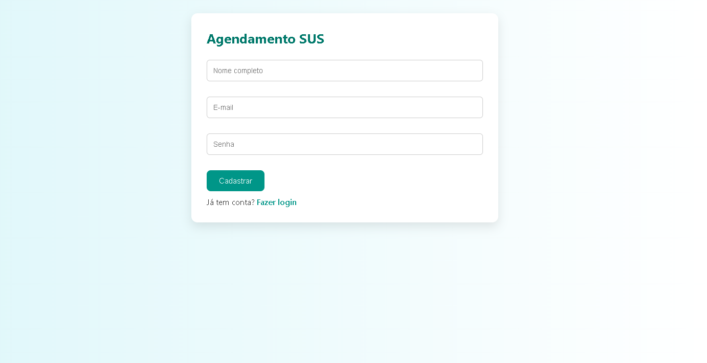
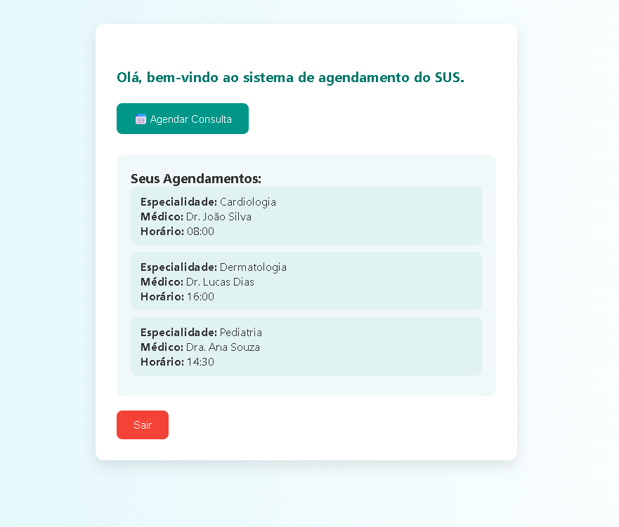
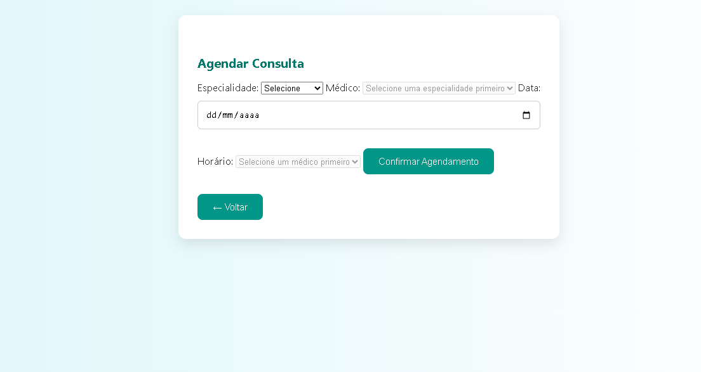
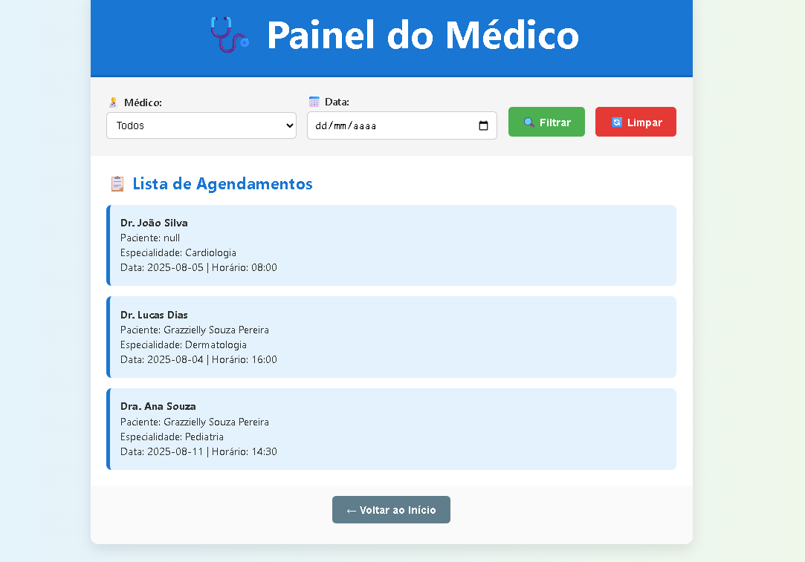

# 🏥 Sistema de Agendamento SUS

Este é um sistema simples de agendamento de consultas para pacientes do SUS. O projeto foi feito utilizando **HTML**, **CSS** e **JavaScript**, com salvamento local dos dados no `localStorage`.

---

## 📸 Imagens do Projeto

### 🔐 Tela de Login

---

### 👤 Área do Paciente

Exibe os agendamentos confirmados:

---

### 📅 Tela de Agendamento

Permite escolher especialidade, médico e horário:

---

### 📅 Painel do médico

Permite os médicos ver os horários/data e nomes de cada paciente com a especialidade com os nomes dos doutores:

---

## 🚀 Funcionalidades

- Cadastro e login de pacientes.
- Sistema de agendamento de consultas por especialidade.
- Listagem de consultas marcadas.
- Sistema de logout com botão "Sair".

---

## 🛠️ Tecnologias

- HTML5
- CSS3
- JavaScript Puro
- Armazenamento local com `localStorage`

---

## 📂 Estrutura do Projeto

