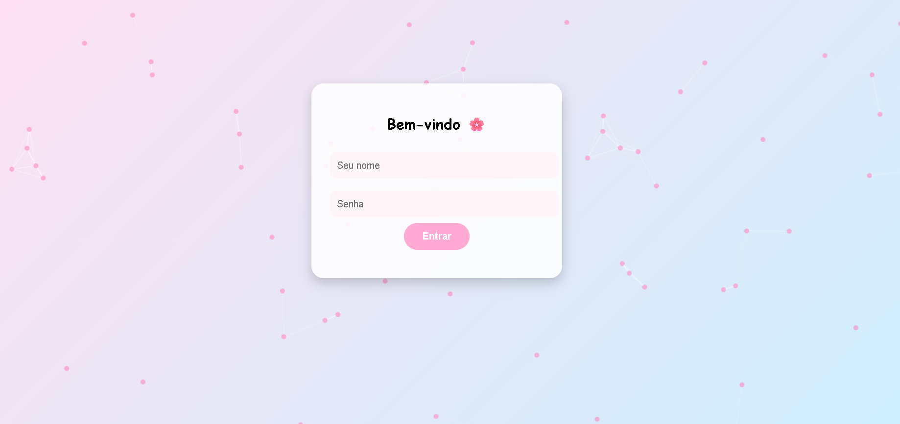

# 🌸 Página de Login Fofinha 🌸

Uma página de login responsiva, com animação de fundo e visual adorável — perfeita para projetos web com um toque meigo! Criada com HTML, CSS, JavaScript e a biblioteca Particles.js 💖

---

## ✨ Funcionalidades

- 🎀 Layout centralizado e estiloso
- 🔐 Campos de nome e senha com armazenamento local (localStorage)
- 🌈 Fundo animado com partículas rosas
- 💻 Totalmente responsiva para celular, tablet e desktop
- 🧁 Estilo pastel com botões arredondados e suaves animações

---

## 📂 Estrutura do Projeto

🧸 Créditos
Projeto criado com muito carinho por Grazzielly ✨
Feito para deixar o seu mundo digital mais doce 💕

📸 Preview

📃 Licença
Este projeto é livre para uso pessoal ou comercial. Personalize à vontade!