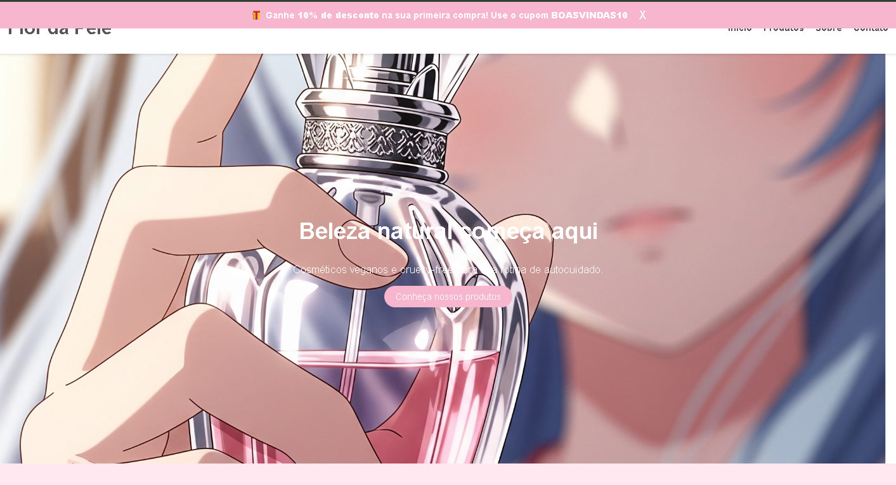
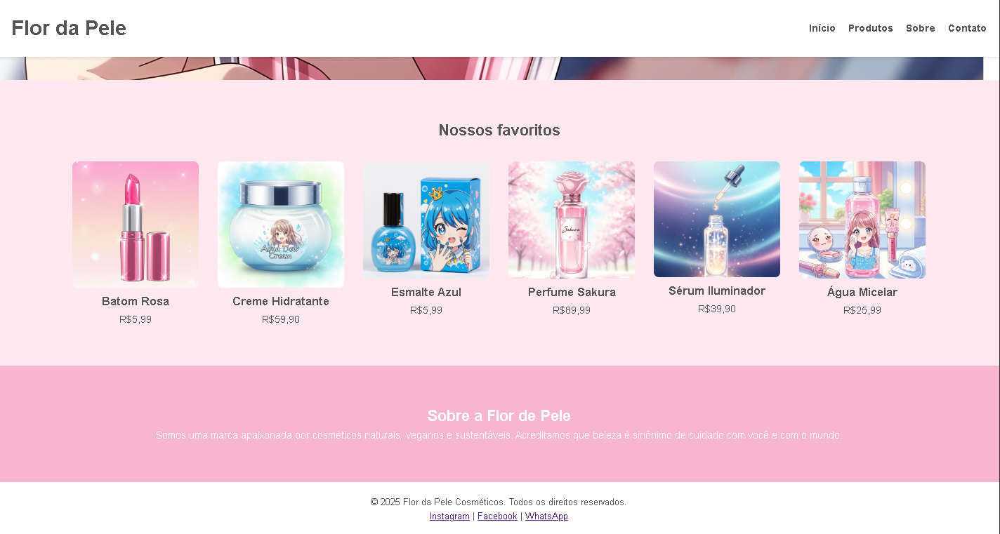

# 🛍️ Loja Online - Projeto Front-End

Este é um projeto de **Loja Online Simples**, desenvolvido em **HTML, CSS e JavaScript**, com sistema de **carrinho de compras** funcional.  
O usuário pode adicionar produtos, remover, alterar quantidades e aplicar um cupom de desconto de boas-vindas.

---

## 🚀 Funcionalidades

- 📱 **Layout Responsivo** (funciona em celulares e desktops).  
- 🛒 **Carrinho de Compras Dinâmico**:
  - Adicionar produtos.
  - Remover produtos.
  - Alterar quantidades.
- 💰 **Cálculo automático do valor total**.  
- 🎁 **Cupom de desconto** (`BOASVINDAS10` - 10% OFF).  
- 🖼️ Interface simples e fácil de navegar.  

---

## 🖥️ Tecnologias Utilizadas

- **HTML5** → Estrutura do site  
- **CSS3** → Estilização e responsividade  
- **JavaScript (ES6)** → Lógica do carrinho e interatividade  

---
## 📸 Prévia do site

## 📱 Responsividade

## 🧚‍♀️ Créditos e inspiração
Desenvolvido com carinho por Grazzielly.  
Inspirado por marcas clean beauty, veganas e cruelty-free 🌱