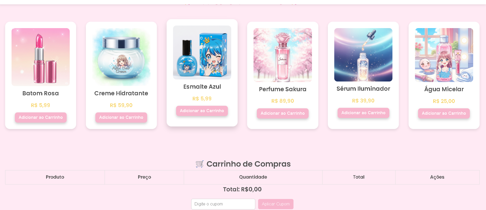

# 🌸 Flor de Pele Cosméticos

Um site de cosméticos bonito e fofo, feito com HTML, CSS e JavaScript puro. Ideal para marcas que valorizam estética suave, produtos naturais e uma experiência encantadora para o cliente.

## ✨ Funcionalidades

- 💖 Banner promocional com cupom de boas-vindas
- 💅 Estilo leve, feminino e moderno
- 📱 Design responsivo (funciona bem em celular)
- 🔘 Menu
- 🌿 Estrutura pensada para lojas de beleza e autocuidado

## 🛠️ Tecnologias utilizadas

- HTML5
- CSS3
- JavaScript (Vanilla JS)

## 📸 Prévia do site

## 📌 Ideias futuras

- Modal com carrinho de compras
- Integração com sistema de pagamento
- Cadastro de newsletter
- Login de cliente

## 🧚‍♀️ Créditos e inspiração
Desenvolvido com carinho por Grazzielly.  
Inspirado por marcas clean beauty, veganas e cruelty-free 🌱