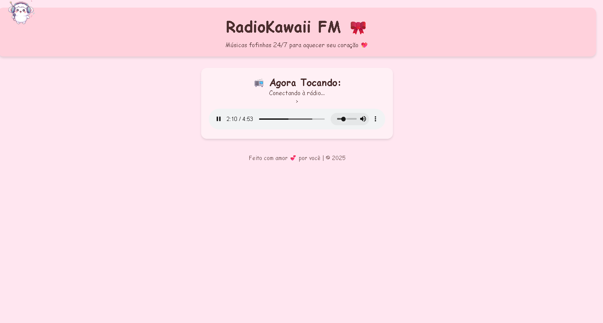

# 💖 RadioKawaii FM 🎀

Bem-vindo à **RadioKawaii FM**, um projeto fofo de rádio online voltado para músicas suaves, J-pop, lo-fi e todo tipo de som que aquece o coração! 🧸🍡

---

## 🎧 Sobre o projeto

A RadioKawaii FM será, em breve, uma **rádio online 24/7**, transmitida diretamente do navegador, com playlists temáticas, auto-DJ e integração ao site oficial. Tudo no estilo mais **kawaii possível**!
📦 Planejamento futuro
🎙️ Streaming real com AzuraCast

👷 **Status atual:**  
Este é um **protótipo em fase de testes**.  
No momento, o player simula uma rádio com **3 músicas locais**, apenas para demonstrar a estrutura e o visual.

---

## 📁 Estrutura atual

- Player de áudio funcional com autoplay e loop
- Visual kawaii adaptado para navegador
- Total de **3 faixas de teste** na pasta `/musicas`

📅 Versão de teste – Agosto de 2025
🎀 Site kawaii em construção…
